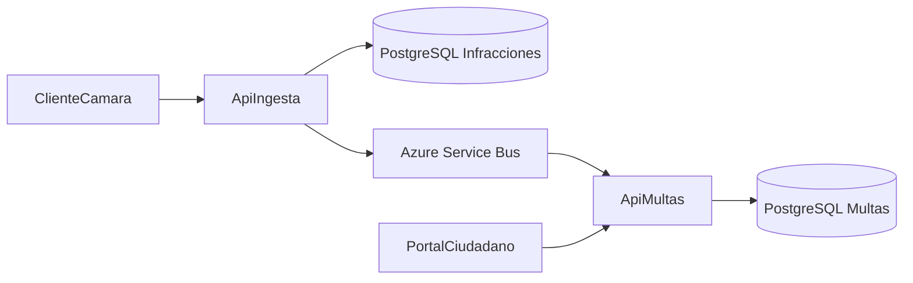
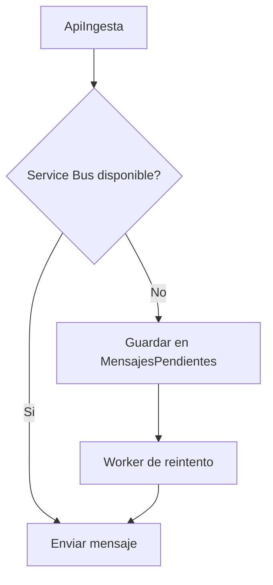
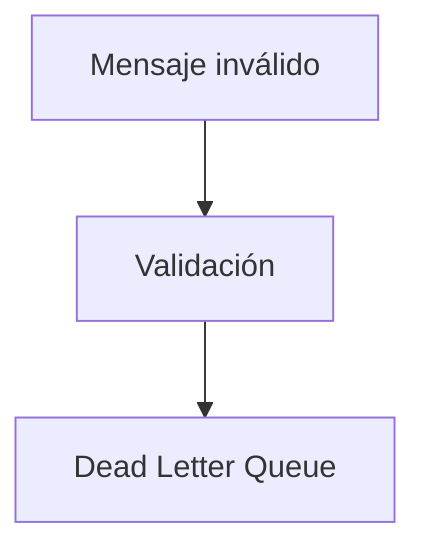

# Sistema de Control de Infracciones de Tránsito

## Autores

- ALCIVAR CORDOVA PEDRO LUIS
- CEDEÑO RODRIGUEZ CARLOS LUIS
- LOOR VERA JORDY LENIN
- RODRIGUEZ SALVATIERRA ENIS ANDERI
- VALENCIA RAMIREZ JHON ROBERT

---

## Descripción del proyecto

Este proyecto implementa un sistema distribuido para la gestión de infracciones de tránsito usando una arquitectura basada en eventos.

Permite registrar infracciones detectadas por cámaras, enviarlas mediante Azure Service Bus, generar multas automáticamente y aplicar mecanismos de resiliencia para evitar la pérdida de información cuando hay fallos en la comunicación.

---

## Objetivos

- Registrar infracciones de tránsito.
- Procesar eventos de forma asíncrona.
- Generar multas automáticamente.
- Implementar mecanismos de resiliencia.
- Gestionar mensajes inválidos mediante DLQ.
- Permitir consultas de multas por placa.

---

## Arquitectura general



## Flujo principal

1. La cámara o cliente envía una infracción a ApiIngesta.
2. ApiIngesta guarda la infracción en PostgreSQL.
3. Publica un evento en Azure Service Bus.
4. ApiMultas consume el evento y genera la multa.
5. La multa queda registrada en PostgreSQL.
6. PortalCiudadano puede consultarla por placa.

---

## Arquitectura de resiliencia



## Arquitectura DLQ



---

## Tecnologías utilizadas

- .NET 10
- ASP.NET Core
- Entity Framework Core
- PostgreSQL
- Azure Service Bus Emulator
- .NET Aspire
- OpenAPI
- PgAdmin

---

## Estructura de la solución

```text
ControlTransito
├── ApiIngesta
├── ApiMultas
├── ClienteCamara
├── PortalCiudadano
├── Shared.Contracts
└── ControlTransito.AppHost
```

---

## Shared.Contracts

Proyecto compartido con los contratos usados entre los microservicios.

Evento principal:

```csharp
InfraccionDetectadaEvent
```

Este contrato permite que ApiIngesta y ApiMultas intercambien información con el mismo formato.

---

## ApiIngesta

Responsable de recibir y almacenar las infracciones.

### Funciones principales

- Recibir infracciones.
- Guardar infracciones en PostgreSQL.
- Publicar eventos en Azure Service Bus.
- Aplicar resiliencia cuando el broker está caído.

### Endpoint

```http
POST /api/infracciones
```

### Ejemplo

```json
{
  "placa": "ABC1234",
  "velocidad": 95,
  "limiteVelocidad": 50,
  "fechaDeteccion": "2026-07-20T00:00:00Z"
}
```

---

## Azure Service Bus

Se utiliza para desacoplar los servicios y mantener el flujo asíncrono.

Cola utilizada:

```text
infracciones-velocidad
```

### Flujo

```text
ApiIngesta -> Azure Service Bus -> ApiMultas
```

---

## ApiMultas

Responsable de consumir eventos y generar multas.

### Funciones principales

- Escuchar la cola de eventos.
- Validar mensajes.
- Crear multas automáticamente.
- Gestionar la Dead Letter Queue.

Se implementa con un BackgroundService.

### Proceso

```text
Mensaje recibido -> Validación -> Creación de multa -> Guardar en PostgreSQL
```

---

## Base de datos

### Tabla Infracciones

Registra las infracciones recibidas.

Campos principales:

```text
Id
Placa
Velocidad
LimiteVelocidad
FechaDeteccion
```

### Tabla Multas

Registra las multas generadas.

Campos principales:

```text
Id
Placa
Valor
FechaEmision
Pagada
```

### Tabla MensajesPendientes

Almacena mensajes cuando el broker de mensajería no está disponible.

Campos:

```text
Id
Payload
FechaCreacion
Procesado
```

---

## Resiliencia

### Problema

Cuando Azure Service Bus está apagado, el mensaje no puede enviarse.

### Solución implementada

```text
ApiIngesta -> Intento de envío -> Error -> Guardar en MensajesPendientes
```

De esta forma no se pierde información.

---

## Worker de reintento

Se implementó un servicio en segundo plano encargado de reenviar automáticamente los mensajes pendientes.

### Proceso

```text
Buscar mensajes pendientes -> Intentar reenviar -> Éxito -> Procesado = true
```

### Beneficios

- Recuperación automática.
- No requiere intervención manual.
- Evita pérdida de datos.

---

## Dead Letter Queue (DLQ)

Se implementó para manejar mensajes inválidos.

### Ejemplo

```json
{
  "placa": "",
  "velocidad": -10
}
```

### Validaciones

- Placa vacía.
- Velocidad menor o igual a cero.
- Mensajes corruptos o inválidos.

### Proceso

```text
Mensaje inválido -> Validación -> DeadLetterMessageAsync() -> DLQ
```

### Beneficios

- Evita ciclos infinitos de reprocesamiento.
- Facilita auditoría y monitoreo.
- Mejora la estabilidad del sistema.

---

## PortalCiudadano

Permite consultar las multas generadas.

### Consultar todas las multas

```http
GET /api/multas
```

### Consultar multas por placa

```http
GET /api/multas/{placa}
```

### Ejemplo

```http
GET /api/multas/ABC1234
```

### Respuesta

```json
[
  {
    "placa": "ABC1234",
    "valor": 150,
    "pagada": false
  }
]
```
